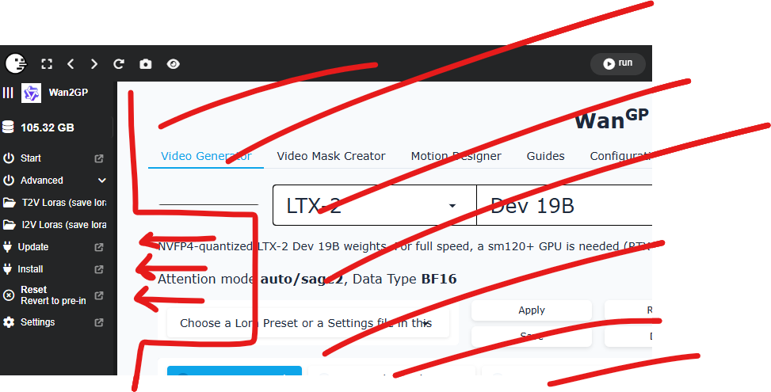

```
 __        __          ____  ____    ____   ___
 \ \      / /_ _ _ __ / ___|  _ \  | ___| / _ \__  ____  __
  \ \ /\ / / _` | '_ \| |  _| |_) | |___ \| | | \ \/ /\ \/ /
   \ V  V / (_| | | | | |_| |  __/   ___) | |_| |>  <  >  <
    \_/\_/ \__,_|_| |_|\____|_|     |____/ \___//_/\_\/_/\_\

    ╔═══════════════════════════════════════════════════════╗
    ║     RTX 50XX ONLY - TEMPORARY UPGRADE LAUNCHER        ║
    ╚═══════════════════════════════════════════════════════╝
```

# WanGP RTX 50XX Pinokio Launcher

**A temporary upgrade path for RTX 50XX users** following [DeepBeepMeep's](https://github.com/deepbeepmeep) explicit upgrade instructions for [WanGP v10.61](https://github.com/deepbeepmeep/Wan2GP).

This launcher is designed to work with the excellent [Pinokio](https://pinokio.computer/) one-click installer app to provide a safe and easy upgrade to **Python 3.11, PyTorch 2.10.0, and CUDA 13.0** for NVFP4 optimized kernel support.

---

## Who Is This For?

**RTX 50XX owners ONLY** who want to take advantage of:
- NVFP4 optimized kernels (30%+ faster generation)
- PyTorch 2.10.0 improvements (no memory leaks, better VAE decoding)
- Latest SageAttention, Triton, and Flash Attention support

If you have an **RTX 40XX or older**, stick with the standard Pinokio WanGP launcher.

---

## How To Use

### Step 1: Clone These Files
Copy the following files into your existing Pinokio `wan.git` folder (usually at `pinokio/api/wan.git/`):
- `install.js`
- `torch.js`
- `update.js`
- `.gitignore`

### Step 2: Reset + Install + Update (in Pinokio)

> **What happens to my models?**
>
> | Folder | Location | After Reset |
> |--------|----------|-------------|
> | HuggingFace models | `cache/HF_HOME/` | **SAFE** - Not deleted |
> | Checkpoints | `app/ckpts/` | **DELETED** - Back these up! |
> | LoRAs | `app/loras/` | **DELETED** - Back these up! |
> | Python environment | `app/env/` | **DELETED** - This is intended |
>
> **Before clicking Reset:** If you have custom checkpoints or LoRAs in the `app/` folder, copy them somewhere safe first!

1. **Open Pinokio** and navigate to WanGP
2. **Click "Reset"** - This removes your old Python 3.10 environment
3. **Click "Install"** - Creates a fresh Python 3.11 environment with PyTorch 2.10/CUDA 13.0
4. **Click "Update"** - Pulls the latest WanGP v10.61 code
5. **Click "Start"** - Launch and enjoy!


*These are the buttons you're looking for in the Pinokio sidebar*

---

## Changes From Original Launcher

| File | What Changed |
|------|--------------|
| `install.js` | Added `venv_python: "3.11"`, enabled all acceleration packages |
| `torch.js` | Complete rewrite for PyTorch 2.10.0+cu130 and new wheel URLs |
| `update.js` | No changes from original |
| `.gitignore` | New file to exclude app/, cache/, logs/, .claude/ |

---

## What Gets Installed

| Component | Version |
|-----------|---------|
| Python | 3.11 |
| PyTorch | 2.10.0+cu130 |
| CUDA | 13.0 |
| SageAttention | 2.2.0 (cu130) |
| Triton | Latest |
| Flash Attention | 2.8.3 |
| xformers | Latest |

---

## Credits

- **[DeepBeepMeep](https://github.com/deepbeepmeep)** - Creator of WanGP
- **[Pinokio](https://pinokio.computer/)** - One-click installer platform
- **[WanGP Discord](https://discord.gg/g7efUW9jGV)** - Community support

---

## Disclaimer

This is a **community-contributed temporary upgrade path** based on DeepBeepMeep's official upgrade instructions. Once Pinokio's official WanGP launcher is updated for RTX 50XX, this repo may become obsolete.

**Use at your own risk.** Always backup your settings before resetting!
